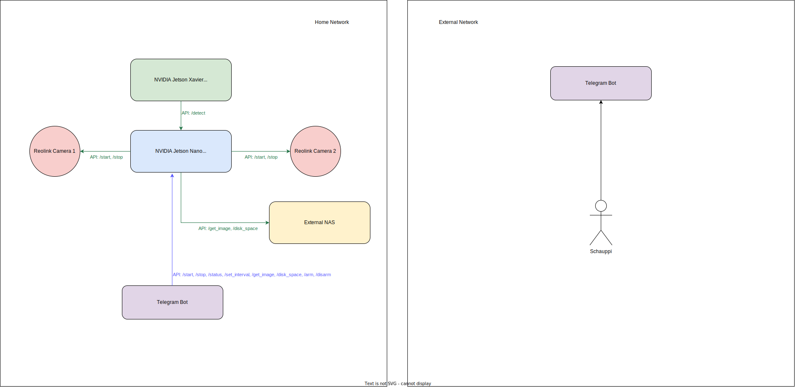

# Project Overview

This project is a robust surveillance system utilizing two Reolink cameras connected to an NVIDIA Jetson Nano. It features a Flask API and storage on an external NAS to save images. System control and monitoring are achieved through a Telegram bot, and an additional Jetson Xavier runs a custom-trained object detection model using a Flask Detection API with TensorRT engine for YOLO models.

# Architecture


# System Components

1. Hardware
* NVIDIA Jetson Nano
* NVIDIA Jetson Xavier
* Two Reolink cameras
* External NAS for storage

2. Software
* Backend + Flask API for camera control and image storage
* Telegram Bot for remote system control
* Backend + Flask Detection API running on Jetson Xavier for person detection using YOLO

# Installation and Setup

## Jetson Nano

1. Environment Setup
* Ensure you have Python 3.8 or higher installed
* Create an virtual environment and activate it
```bash
python3 -m venv venv
source venv/bin/activate
```
* Install the required packages
```bash
pip install -r requirements_jetson.txt
```

2. Configuration
* Create a new Telegram bot and get the API token
* Change the .env example into .env and fill in the required information
    * TELEGRAM: Telegram API token
    * TELEGRAM_CHAT_ID: Chat ID for the bot
* Setup the Reolink cameras with username, password and static ip
* Change the reolink_credentials_example.json into reolink_credentials.json and fill in the required information
    * Username, Password, IP-address

3. Running the system
* Run the Flask API
```bash
python -m src.api.api
```

## Jetson Xavier